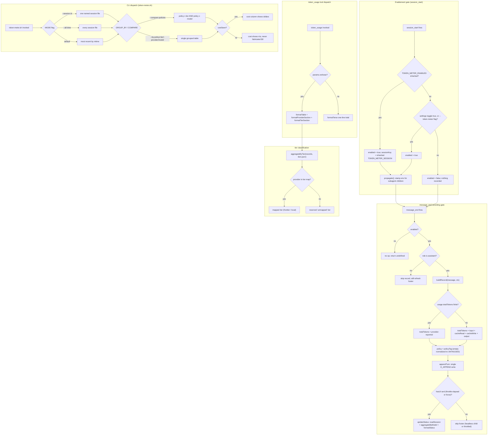
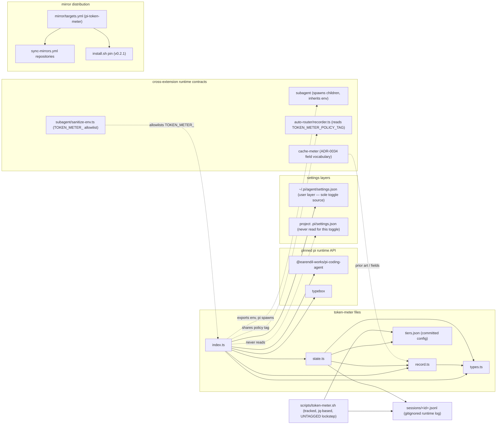

# token-meter

A per-session, per-model **token-usage counter** for pi ([ADR-0073](https://github.com/psmfd/pi-config/blob/main/adrs/0073-token-meter-extension.md)).
When enabled, it records the token usage of every assistant turn and lets you see
the total tokens (and cost) a session consumed, broken down by model — including
work done by subagents.

## Install

```sh
pi install git:github.com/psmfd/pi-token-meter
```

Try it first without installing: `pi -e git:github.com/psmfd/pi-token-meter`.

## Enabling / disabling

**Inert by default** — nothing is recorded unless you opt in.

- **Persistent (per user):** set `extensionSettings.tokenMeter.enabled: true` in
  `~/.pi/agent/settings.json` (see `agent/settings.example.json` for the block).
  Only the user-layer setting is honored — a project's `.pi/settings.json` cannot
  flip metering, closing the "a hostile repo hides its own cost" trust gap.
- **Per session:** launch with `--token-meter`, or toggle mid-session with
  `/token-meter on|off` (`/token-meter status` reports the running total;
  `/token-meter policy <tag>` retags this process — see the policy section).

When on, the status bar shows a live whole-tree counter — e.g.
`📊 412k tok · $1.23 · 2 models` — refreshed from the session log as turns
land (subagent usage included), falling back to `📊 token-meter: on` until the
first record. The dollar segment is omitted when no turn reported cost
(absence ≠ zero, [ADR-0105](https://github.com/psmfd/pi-config/blob/main/adrs/0105-token-meter-strict-env-carveout.md)).

## What it does

When enabled, the `message_end` handler appends one JSONL record per **assistant**
turn to a per-session log at
`~/.pi/agent/extensions/token-meter/sessions/<session-id>.jsonl` (the `<session-id>`
is pi's own session id, so it lines up with the session transcript):

```jsonc
{ "ts":"2026-07-04T14:32:01Z","turn":5,"model":"claude-sonnet-5","provider":"anthropic",
  "input":812,"cacheRead":4200,"cacheWrite":0,"output":340,"totalTokens":5352,"costTotal":0.0193,
  "policy":"mixed-local" }
```

`input` is **fresh** (uncached) input; `cacheRead`/`cacheWrite` are prompt-cache
tokens (priced far below fresh). The four-way breakdown is always kept — a single
"total" would hide the cost-relevant split — and every reporting surface (the
verbose tool tables and the CLI) renders all four columns.

**Whole-tree accounting.** pi runs subagents as separate processes. When enabled,
the root session exports its session id into the environment, so every subagent
process records to the **same** session file — the session total includes subagent
usage (this repo's primary orchestration mechanism), not just top-level turns.

**Observational only.** The `message_end` handler returns `undefined` and never a
replacement message — rewriting the message would churn the provider's cached
prefix. It makes no network calls and logs only numeric usage + model/provider
strings, never message content.

## How it works

**Lifecycle and retrieval.** How enablement, per-turn recording, subagent
whole-tree accounting, the live footer, and the two read paths (tool + CLI)
relate:

```mermaid
sequenceDiagram
    participant User
    participant Pi as pi runtime
    participant TM as token-meter
    participant Settings as settings.json (user layer)
    participant Log as sessions/&lt;id&gt;.jsonl
    participant Child as subagent child
    participant UI as status bar / notify
    participant CLI as token-meter.sh

    Pi->>TM: session_start(ctx)
    TM->>Settings: read extensionSettings.tokenMeter.enabled
    Settings-->>TM: enabled true/false (user layer only)
    TM->>Pi: stamp TOKEN_METER_SESSION + TOKEN_METER_ENABLED into process.env
    Pi->>Child: spawn subagent (child inherits env)
    Child->>Child: resolveSessionKey reads inherited TOKEN_METER_SESSION
    Child->>Log: appendTurn for child turns
    Pi->>TM: message_end(event, ctx)
    TM->>Log: appendTurn for this assistant turn
    TM->>Log: readSession (throttled re-read)
    TM->>UI: setStatus with compact whole-tree total
    User->>Pi: /token-meter on|off|status|policy <tag>
    Pi->>TM: registerCommand handler
    TM->>UI: notify ON/OFF + policy tag
    User->>Pi: token_usage tool call
    Pi->>TM: execute(params)
    TM->>Log: readSession(sessionKey)
    TM-->>User: terse line, or verbose per-model/provider/tier tables
    User->>CLI: run with --session/--all-time/--by-tier/--by-policy/…
    CLI->>Log: read one or more jsonl files with jq
    CLI-->>User: INFO rows + TOTAL line
```

**Decisioning.** The gates that decide whether a turn is recorded, how a total is
derived, how a provider maps to a tier, and how the two dispatch surfaces route:



**Dependencies.** The extension owns its own `state.ts` (no `shared/` dependency)
and never imports another extension. Its cross-extension links are **runtime
contracts** — inherited env vars and shared field vocabulary — drawn dotted below,
not code imports (cross-extension imports are forbidden except via `shared/`):



## Retrieving usage

**In-session** — the `token_usage` tool (terse by default; `verbose:true` adds
the per-model, per-provider, and per-tier tables):

```text
Session tokens: 64,060 (claude-sonnet-5) + 5,800 (claude-haiku-4) = 69,860 total · $0.33
```

**CLI** — `scripts/token-meter.sh` reads the same logs:

```sh
scripts/token-meter.sh                 # current session (most recent by mtime)
scripts/token-meter.sh --session <id>  # one named session
scripts/token-meter.sh --all-time      # aggregate across every session
scripts/token-meter.sh --by-provider   # group by provider instead of model
scripts/token-meter.sh --by-tier       # group by tier (frontier/local/unmapped)
scripts/token-meter.sh --by-policy     # group by routing-policy tag (#521)
scripts/token-meter.sh --by-policy-tier   # cross-tab: policy x tier
scripts/token-meter.sh --by-policy-model  # cross-tab: policy x model
scripts/token-meter.sh --compare-policies # policy x tier + policy x model report
scripts/token-meter.sh --list          # list sessions (id, started, turns)
```

```text
INFO  current session=b3f0a1
INFO  claude-sonnet-5: turns=9 input=7340 cacheRead=51200 cacheWrite=2400 output=3120 total=64060 cost=$0.31
INFO  claude-haiku-4: turns=3 input=1200 cacheRead=4000 cacheWrite=0 output=600 total=5800 cost=$0.02
==================================
TOTAL — 12 turns, 69860 tokens, $0.33
```

Override where the CLI reads logs from with `TOKEN_METER_SESSIONS_DIR` (defaults
to the per-extension sessions dir) — the same override pattern as
`TOKEN_METER_TIERS_FILE` below.

## Provider and tier rollups

`tiers.json` (committed next to the extension) classifies each provider into a
tier — `frontier` (e.g. `anthropic`, `github-copilot`) or `local` (e.g. `omlx`).
`--by-provider` / `--by-tier` on the CLI, and the verbose `token_usage` output,
aggregate on those axes so an all-frontier session can be compared against a
mixed frontier+local one. Providers absent from the map report as **`unmapped`**
— never silently folded into a real tier. Override the map location with
`TOKEN_METER_TIERS_FILE`; a missing or corrupt map degrades to all-unmapped
without breaking metering.

Two measurement caveats, by design:

- **Local cost renders `n/a`, never $0.** Local providers typically report no
  `usage.cost.total`, so a frontier-vs-local comparison is **token-count-based**;
  dollar totals only cover turns whose provider reported cost.
- **Copilot cache fields are unreliable upstream** (`cacheRead`/`cacheWrite`
  reported as 0 — SDK issue #1073, see cache-meter). Cross-provider cache-ratio
  comparisons are not meaningful; raw input/output/total counts are unaffected.

## Routing-policy tagging and A/B comparison (#521, [ADR-0077](https://github.com/psmfd/pi-config/blob/main/adrs/0077-routing-policy-tag-and-streaming-usage.md))

Every record carries a `policy` field: the operator's A/B label from
`TOKEN_METER_POLICY_TAG`, normalized to the sentinel `"untagged"` when unset.
(Disambiguation: this is a **measurement label** — nothing routes on it; it is
unrelated to auto-router's candidate-selection policy or ADR-0076's tier
policy.) Because subagent children inherit the parent's environment, a whole
orchestration tree records one consistent label:

```sh
TOKEN_METER_POLICY_TAG=mixed-local  pi --token-meter -p "…"   # arm A
TOKEN_METER_POLICY_TAG=all-frontier pi --token-meter -p "…"   # arm B
scripts/token-meter.sh --all-time --compare-policies           # the A/B report
```

- The tag is an env **snapshot** captured at process spawn: a mid-session
  `export` in your shell is never seen, and `/token-meter policy <tag>` retags
  only this process going forward (already-spawned children keep the old tag —
  the same ADR-0073 env-capture caveat as `/token-meter off`).
- Records with no `policy` field (logs written before #521) aggregate under
  `untagged` — never dropped. The sentinel is defined once (`UNTAGGED` in
  `record.ts`) and the CLI's jq default is kept in lockstep by a unit test.
- CLI views: `--by-policy`, `--by-policy-tier`, `--by-policy-model`, and
  `--compare-policies` (both cross-tabs in one report). They compose with
  `--session`/`--all-time` like every other grouping flag.

## Files

| File | Role |
|---|---|
| `index.ts` | handlers (`session_start`, `message_end`), the `/token-meter` command + `--token-meter` flag, the `token_usage` tool, and the subagent env propagation |
| `record.ts` | pure record building + per-model/provider/tier/policy aggregation + output formatting + the `UNTAGGED` sentinel |
| `state.ts` | per-session append-only log + corruption-tolerant reader + session-id sanitization + tier-map loader |
| `types.ts` | usage/record/totals/tier-map shapes |
| `tiers.json` | committed provider → tier map (`frontier` / `local`) for the rollups |

## Tests

```sh
./scripts/test-token-meter.sh       # extension unit tests
./scripts/token-meter.sh --self-test  # CLI aggregation self-test
```

Both are gated under `scripts/validate.sh`.
